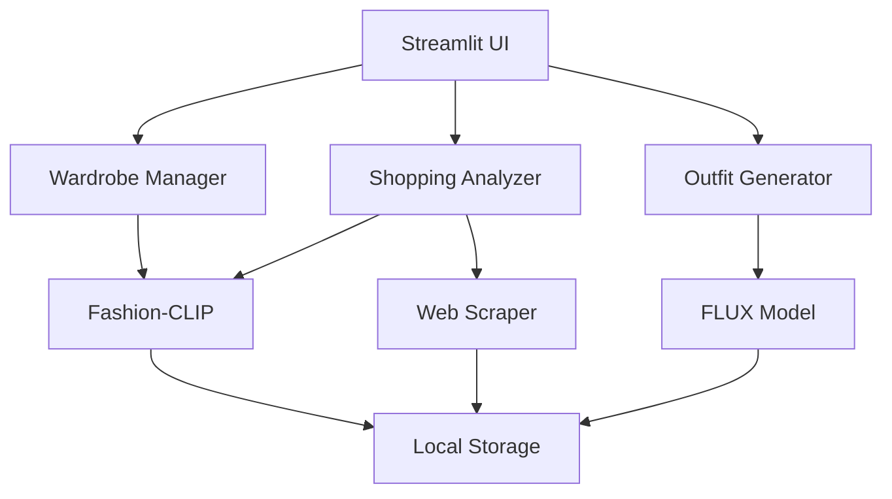

# Fashion Assist POC
## AI-Powered Shopping Companion (1-Week School Project)

A proof of concept demonstrating how multiple AI models can work together to help users make better clothing purchases by analyzing their wardrobe and generating outfit visualizations.

  

---

## 🎯 Project Overview

### What It Does
- **📸 Wardrobe Digitization**: Upload clothing photos, get automatic AI categorization
- **🛒 Shopping Analysis**: Paste shopping URLs, extract product info and compatibility scores  
- **✨ Outfit Generation**: Create realistic outfit visualizations using AI image generation

### AI Models Used
- **Fashion-CLIP**: Fashion-specific vision-language model for categorization and compatibility
- **FLUX Outfit Generator**: Text-to-image model specialized for fashion/clothing
- **Web Scraping**: Custom scraper for extracting product data from shopping sites

---

## 🚀 Quick Start

### Prerequisites
- MacBook Pro M4 Pro (or similar with 48GB+ RAM)
- Python 3.9+
- **uv** (fast Python package manager) - Install: `curl -LsSf https://astral.sh/uv/install.sh | sh`
- Internet connection for model downloads

> **Why uv?** 10-100x faster than pip, better dependency resolution, modern Python tooling

### Installation

```bash
# Clone repository
git clone <your-repo-url>
cd fashion_assist_poc

# Initialize project with uv (faster than pip/venv)
uv init --python 3.11

# Install dependencies
uv add streamlit torch torchvision transformers diffusers accelerate
uv add open-clip-torch Pillow opencv-python numpy
uv add requests beautifulsoup4 selenium scikit-learn pandas

# Create directory structure
mkdir -p data/{wardrobe,scraped,generated}

# Run application
uv run streamlit run app.py
```

### First Run
1. Open `http://localhost:8501` in your browser
2. Upload 2-3 clothing photos in "Upload Wardrobe" tab
3. Paste a shopping URL in "Analyze Shopping" tab
4. Generate outfit in "Generate Outfit" tab

---

## 📁 Project Structure

```
fashion_assist_poc/
├── app.py                     # Main Streamlit application
├── models/
│   ├── fashion_clip.py        # Fashion-CLIP wrapper for categorization
│   └── outfit_gen.py          # FLUX outfit generation model
├── utils/
│   ├── scraper.py             # Web scraping for shopping sites
│   └── file_manager.py        # Local file operations
├── data/
│   ├── wardrobe/              # User uploaded clothing images
│   ├── scraped/               # Downloaded shopping item images  
│   └── generated/             # AI generated outfit images
├── docs/
│   ├── fashion_assist_poc_spec.md    # Detailed project specification
│   ├── implementation_guide.md       # Step-by-step implementation
│   └── demo_script.md               # Demo presentation guide
└── requirements.txt           # Python dependencies
```

---

## 🔧 Technical Details

### Architecture


### Model Specifications
- **Fashion-CLIP**: 600MB, ViT-B/32 architecture, fashion-specialized
- **FLUX Outfit Generator**: ~12GB, text-to-image diffusion model
- **Total Memory Usage**: ~30GB peak (fits comfortably in 48GB)

### Performance
- **Fashion-CLIP categorization**: ~500ms per image
- **FLUX outfit generation**: ~30-45 seconds per image
- **Web scraping**: ~2-5 seconds per URL

---

## 🎨 Features

### 1. Wardrobe Digitization
- Upload multiple clothing images
- Automatic categorization (shirt, pants, dress, etc.)
- Color and style detection
- Digital wardrobe organization

### 2. Shopping Analysis
- Paste any shopping URL
- Extract product images and details
- AI-powered compatibility scoring
- Integration with existing wardrobe

### 3. Outfit Generation
- Select items from wardrobe + shopping
- Choose style preferences (casual, formal, etc.)
- Generate realistic outfit visualizations
- Download generated images

---

## 🛠 Usage Examples

### Analyzing a Shopping Item
```python
# Example shopping URLs that work well:
- H&M: https://www2.hm.com/en_us/productpage.0570006001.html
- Zara: https://www.zara.com/us/en/basic-t-shirt-p00706460.html
- Target: https://www.target.com/p/women-s-short-sleeve-t-shirt/
```

### Outfit Generation Process
1. Upload wardrobe items (get auto-categorized)
2. Analyze shopping item from URL
3. Select 2-3 items for combination
4. Choose style (casual/formal/business)
5. Generate AI outfit visualization

---

## 🎯 Demo Instructions

### 5-Minute Demo Flow
1. **Upload wardrobe** (30 seconds) - Show AI categorization
2. **Analyze shopping URL** (90 seconds) - Show web scraping + compatibility
3. **Generate outfit** (120 seconds) - Show AI image generation
4. **Show results** (30 seconds) - Highlight generated outfit

### Sample Data for Demo
- Prepare 3-4 clothing photos
- Test shopping URLs from major retailers
- Pre-generate backup examples

See [demo_script.md](docs/demo_script.md) for detailed presentation guide.

---

## 🧪 Testing

### Manual Testing Checklist
- [ ] Upload various clothing types
- [ ] Test different shopping site URLs
- [ ] Generate outfits with different styles
- [ ] Verify file storage and retrieval
- [ ] Check error handling

### Known Limitations (POC)
- Limited to major e-commerce sites
- Basic outfit generation (no body type consideration)
- Local storage only (no user accounts)
- Simplified UI for demo purposes

---

## 📈 Future Improvements

### Short-term (1-2 weeks)
- Support for more shopping sites
- Improved outfit generation prompts
- Better error handling and user feedback
- Mobile-responsive design

### Medium-term (1-2 months)
- User accounts and persistent storage
- Social features (sharing outfits)
- Seasonal and weather recommendations
- Integration with shopping carts

### Long-term (3-6 months)
- Body type and fit consideration
- Video outfit try-on
- Personal stylist recommendations
- Commercial partnerships

---

## 📚 Documentation

- **[Project Specification](docs/fashion_assist_poc_spec.md)**: Detailed technical requirements
- **[Implementation Guide](docs/implementation_guide.md)**: Step-by-step development instructions  
- **[Demo Script](docs/demo_script.md)**: Presentation and demo guidelines

---

## 🤝 Contributing

This is a school project/POC, but contributions are welcome:

1. Fork the repository
2. Create feature branch (`git checkout -b feature/AmazingFeature`)
3. Commit changes (`git commit -m 'Add some AmazingFeature'`)
4. Push to branch (`git push origin feature/AmazingFeature`)
5. Open a Pull Request

---

## 📄 License

This project is licensed under the MIT License - see the [LICENSE](LICENSE) file for details.

---

## 🙏 Acknowledgments

- **Fashion-CLIP**: Patrick John Chia et al. for the fashion-specialized CLIP model
- **FLUX Models**: Black Forest Labs for the outfit generation model
- **Streamlit**: For the rapid web app development framework
- **Hugging Face**: For model hosting and transformers library

---

## 📞 Contact

Project Link: [https://github.com/yourusername/fashion-assist-poc](https://github.com/yourusername/fashion-assist-poc)

Built with ❤️ in 1 week for [Your School/Course Name]